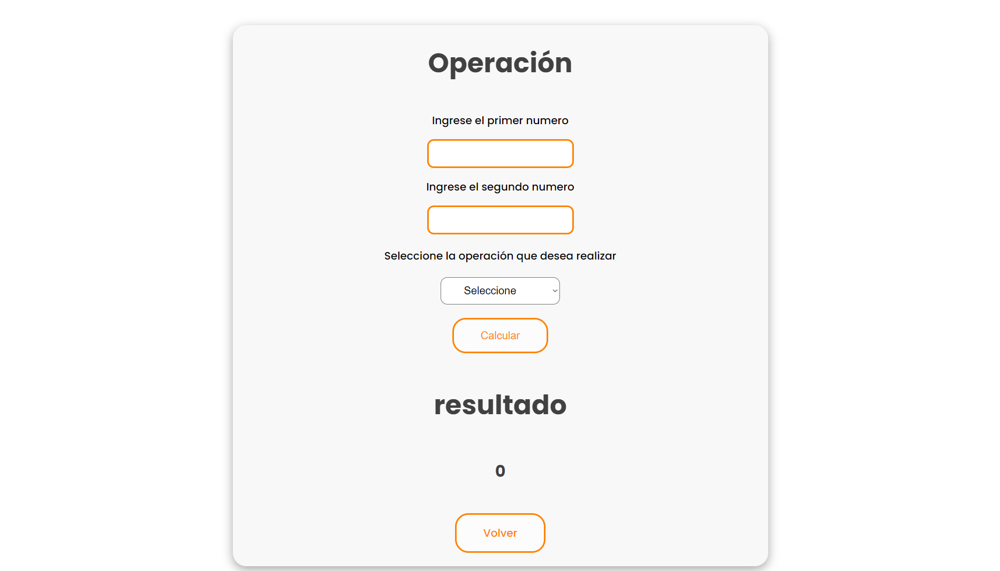

<h1>Taller Back-end </h1>

 se agrega fotos del taller del back-end

</img>
</img>
</img>
</img>
</img>
</img>
</img>
</img>
</img>
</img>

<a href="https://github.com/0m4rP/Kawasaki-back"> enlace de git de kawasaki</a>